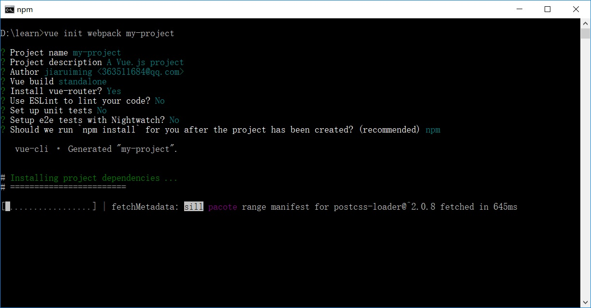

## 第一章、开始使用Vue

> Vue是一个现代的前端js框架，完全颠覆了传统的前端开发模式，如果想要现在开始学习前端开发，那就直接从Vue开始吧。

### 1. 安装开发环境

#### 1.1 安装Node.js

Node.js是现代前端开发必备的环境。[点击下载](http://nodejs.cn/)

#### 1.2 安装Git

Git是一款强大的代码管理工具。[点击下载](https://git-scm.com/)

#### 1.3 安装vscode

vscode是一款好用的代码编辑工具。[点击下载](https://code.visualstudio.com/Download)

### 2. 用Vue-cli创建第一个Vue项目

打开cmd窗口，输入命令

    npm -v

如果Node.js安装正确，那么会打印出npm的版本号，而npm是Node.js下的一个包管理工具，用来管理第三方的js代码包。

接下来配置淘宝镜像源，因为众所周知的原因，国内访问国外的网站会非常慢，输入命令

    npm config set registry https://registry.npm.taobao.org

然后就可以通过npm来安装Vue-cli这个包，Vue-cli是Vue官方提供的用来快速构建Vue项目的工具，输入命令

    npm install vue-cli -g

-g在这里是表示全局安装的意思，这样vue-cli这个包会安装到系统盘一个固定的位置，在任何时候都可以直接使用。

然后就是通过vue-cli来创建Vue项目了，输入命令

    vue init webpack my-project

其中my-project可以换成其他名字，而webpack表示使用webpack模板来构建项目，这是一种用来将Vue项目打包成通用的html、js和css文件的工具。

每个选项按上图所示来选，完成之后输入命令

    cd my-project
    npm run dev

就可以运行本地开发模式，这时用浏览器打开网址`http://localhost:8080/`就可以看到这个项目了。

### 3. 如何使用Vue

关于Vue的教程网上有很多，这里就不再赘述了。建议初学者先看看[Vue官网](https://cn.vuejs.org/)上的教程。

也可以在网上买实体书学习，推荐这本[《Vue.js实战》](https://item.jd.com/12215519.html)，是由Vue的创始人尤雨溪推荐并作序。