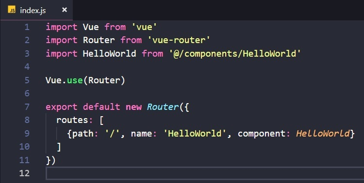
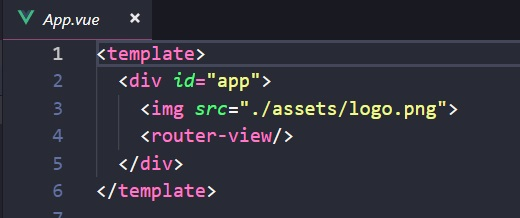

## 第二章、Vue-router和axios

> Vue项目的核心功能就是Vue-router和axios，Vue-router是路由工具，用来在不同页面间跳转，而axios是ajax请求工具，用来向服务器发送ajax请求。

### 1. Vue-router

现代的前端页面能提供一个App所能提供的所有功能，所以这就是WebApp的由来，而Vue构建的项目正是为了开发WebApp。

开发WebApp的比较流行的一种方式叫做单页应用，就是说用户访问网页时只加载了一个html页面，但是通过js的控制，可以让页面显示不同的内容，这样比较好的模拟了原生App的效果。

那么回到Vue-router上，这个工具正是为了实现单页应用而诞生的。

上图就是路由的配置代码，这段代码表示访问`/`路径时会渲染`HelloWorld`组件。

而`HelloWorld`组件出现的位置，就在上图中`<router-view/>`所在的位置。

### 2. axios

axios是官方推荐的ajax请求工具，因为vue-cli创建的项目中没有包含这个工具，所以需要手动安装一次，输入命令

    npm install axios -save

-save表示要将某个包安装到依赖库里，这样在打包时，webpack就会自动把这个包的代码一起打包到最终的js文件里。

在`src`目录下新建一个`api.js`的文件，输入以下代码

    import axios from 'axios';
    import qs from 'qs';

    axios.defaults.timeout = 5000;
    axios.defaults.baseURL = process.env.API_URL;

    axios.interceptors.request.use(
    config => {
        config.headers = {
        'Content-Type': 'application/x-www-form-urlencoded'
        };
        if (config.method == 'post') {
        config.data = qs.stringify(config.data)
        }
        return config;
    },
    err => {
        return Promise.reject(err);
    }
    );

    export default axios;

然后在`main.js`文件里加入以下代码

    import api from './api.js'
    global.api = api

将axios赋值给全局变量`api`，这样在任何页面上都可以直接通过`api.get`或`api.post`这样的方式来实现ajax请求。