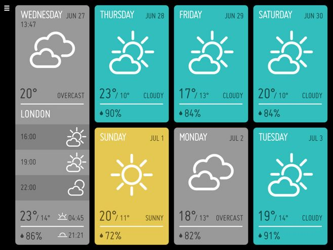
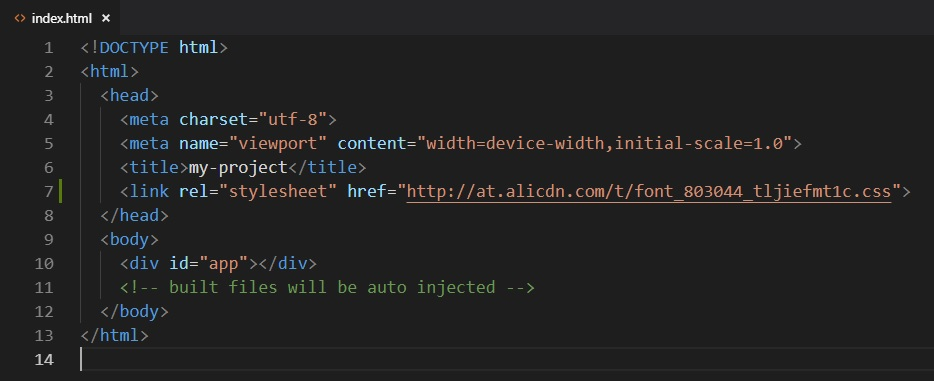
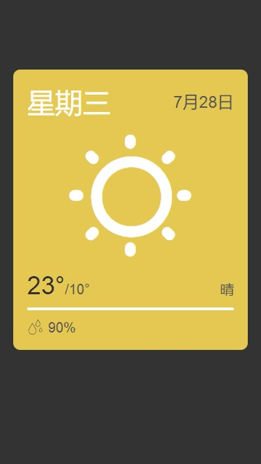

## 第三章、来做个天气应用吧（1）

> 使用前面两章介绍的基础工具，我们可以开始尝试做一个天气应用了。

### 1. 准备工作

天气接口地址：https://www.sojson.com/open/api/weather/json.shtml?city=成都

返回的数据格式：

    {
      "date": "20180815",
      "message": "Success !",
      "status": 200,
      "city": "成都",
      "count": 2,
      "data": {
        "shidu": "93%",
        "pm25": 47.0,
        "pm10": 77.0,
        "quality": "良",
        "wendu": "25",
        "ganmao": "极少数敏感人群应减少户外活动",
        "yesterday": {
          "date": "14日星期二",
          "sunrise": "06:28",
          "high": "高温 34.0℃",
          "low": "低温 24.0℃",
          "sunset": "19:48",
          "aqi": 92.0,
          "fx": "无持续风向",
          "fl": "<3级",
          "type": "多云",
          "notice": "阴晴之间，谨防紫外线侵扰"
        },
        "forecast": [
          {
            "date": "15日星期三",
            "sunrise": "06:29",
            "high": "高温 36.0℃",
            "low": "低温 25.0℃",
            "sunset": "19:47",
            "aqi":84.0,
            "fx": "无持续风向",
            "fl": "<3级",
            "type": "晴",
            "notice": "愿你拥有比阳光明媚的心情"
          },
          {
            "date": "16日星期四",
            "sunrise": "06:30",
            "high": "高温 35.0℃",
            "low": "低温 23.0℃",
            "sunset": "19:46",
            "aqi":81.0,
            "fx": "无持续风向",
            "fl": "<3级",
            "type": "阵雨",
            "notice": "阵雨来袭，出门记得带伞"
          },
          {
            "date": "17日星期五",
            "sunrise": "06:30",
            "high": "高温 31.0℃",
            "low": "低温 24.0℃",
            "sunset": "19:45",
            "aqi":59.0,
            "fx": "无持续风向",
            "fl": "<3级",
            "type": "多云",
            "notice": "阴晴之间，谨防紫外线侵扰"
          },
          {
            "date": "18日星期六",
            "sunrise": "06:31",
            "high": "高温 32.0℃",
            "low": "低温 24.0℃",
            "sunset": "19:44",
            "aqi":62.0,
            "fx": "无持续风向",
            "fl": "<3级",
            "type": "阵雨",
            "notice": "阵雨来袭，出门记得带伞"
          },
          {
            "date": "19日星期日",
            "sunrise": "06:31",
            "high": "高温 32.0℃",
            "low": "低温 24.0℃",
            "sunset": "19:43",
            "aqi":68.0,
            "fx": "无持续风向",
            "fl": "<3级",
            "type": "多云",
            "notice": "阴晴之间，谨防紫外线侵扰"
          }
        ]
      }
    }

从上面可以很直观的看到返回数据的含义，我们就基于这个数据来开发可以查询天气的App。

### 2. 开始动手

首先要让我们的应用运行起来，能够一边改一边看到效果。

修改`App.vue`里的代码

    <template>
      

        <router-view/>
      

    </template>

    

    

删除`components`目录里的默认组件`HelloWorld.vue`

在`src`目录下新建一个`pages`目录，用来存放用户能直接访问到的页面。然后在`pages`目录下新建一个`Index.vue`文件，这个文件就是应用的首页。复制以下代码到文件里

    <template>
      

        HelloWorld
      

    </template>

    

    

最后为了能够访问到我们的首页，需要修改路由的配置。打开`router/index.js`，按照以下代码来进行修改

    import Vue from 'vue'
    import Router from 'vue-router'
    import Index from '@/pages/Index'

    Vue.use(Router)

    export default new Router({
      routes: [
        {path: '/', name: 'index', component: Index}
      ]
    })

#### 2.1 首页

先自行在百度上搜一个你喜欢的天气App模板，然后照着来写页面。一般前端开发都是先写出静态页面，把页面样式调整到最佳状态后，再引入真实的数据。

举个栗子吧，这个设计感觉很不错：

不过这个是根据电脑上的屏幕来设计的，我们需要提取出其中的设计特点，来自己开发适用于手机上的UI界面。

* 要点1：图标怎么办？

  以前前端开发一般都用图片来处理图标，但是随着手机屏幕的分辨率越来越高，图标已经满足不了精细化显示的需求了。现代前端开发大都使用字符图标，就是把一个个图标做成字体文件，就像在电脑上打的汉字一样，可以随意设置大小和颜色，并且不会有任何失真。

  推荐一个比较好用的字符图标网站[Iconfont](http://www.iconfont.cn/)，这是阿里巴巴公司维护的一个专门提供字符图标的网站。

  按照网站上的方法选择好图标，然后加入到自定义的项目里，再把生成的css链接复制到`index.html`文件中，就可以使用字符图标了。

  

* 要点2：页面怎么适配不同大小的屏幕？

  直接上解决方案：`rem`。这是一个相对长度单位，相对于`html`元素的`font-size`的大小，也就是说如果`html`元素的`font-size`是16px，那么1rem就等于16px。

  问题来了，如果`html`元素的`font-size`属性是固定的长度，那么不同屏幕下的1rem也不都等于固定的像素值么。

  要解决这个问题，还要再引入一个单位：`vw`和`vh`。这两者是百分比单位，定义是100vw等于屏幕的宽度，100vh等于屏幕的高度。只要把`vw`同`rem`结合起来，就可以实现页面的自适应。

  上个代码：

      html {
        font-size: 5.3333333vw;
      }
  
  举例说明一下，当手机屏幕宽度是375px时（iPhone6的宽度），可以计算出`font-size`等于20px，那么这时1rem就表示20px，这样所有的px单位都可以根据这个比例换算成rem单位。

最后写出来的静态页面长这个样子：

后面再逐步来丰富这个天气App的各种功能。

下面把目前的首页代码放上来作为参考：

    <template>
      

        

        

        

          

            
星期三

            
7月28日

          

          

            <i class="iconfont icon-qing"></i>
          

          

            
23°/10°

            
晴

          

          

          
<i class="iconfont icon-lab-yudi"></i>90%

        

      

    </template>

    

    

